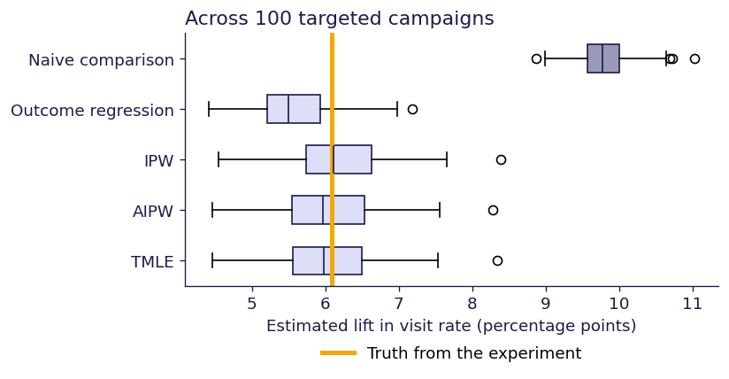
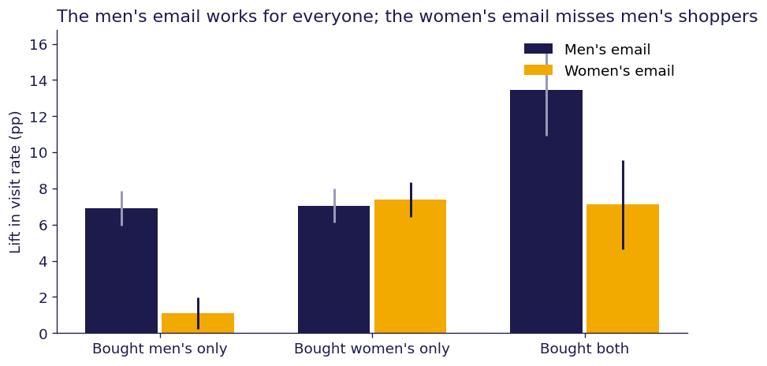

# Did the email campaign actually work?

**Measuring the true impact of a marketing campaign when customers weren't chosen at random.**

When a marketing team emails its best customers and then sees those customers visit more, how much of that is the email and how much is the customers? This project answers that question with causal inference, and checks every answer against a real randomised experiment.



## Key findings

- **The email works.** In a randomised experiment on 64,000 customers, an email raised the two-week website visit rate by **6.1 percentage points** (95% CI 5.5 to 6.6), from 10.6% to about 17%, a relative lift of over 50%.
- **Naive analysis overstates the effect by about 60%.** When the campaign is targeted at high-value, recently active customers, simply comparing emailed and non-emailed customers suggests a lift of about 9.8 points. Its confidence interval missed the truth in all 100 simulated campaigns.
- **Doubly robust methods recover the truth.** AIPW and TMLE were essentially unbiased (average error 0.01 points) and their 95% confidence intervals contained the true value in 95% of runs, exactly as they should.
- **Which email matters.** The men's merchandise email lifts visits for every type of shopper, but the women's email barely moves customers who only buy men's products (1.1 points versus 6.9). The men's email is the better default.

## Approach

1. **Ground truth.** The [Kevin Hillstrom MineThatData](https://blog.minethatdata.com/2008/03/minethatdata-e-mail-analytics-and-data.html) dataset comes from a randomised experiment, so a simple comparison gives the true effect.
2. **A realistic targeted campaign.** I turn the experiment into observational data in which recent, high-spending, multichannel customers were much more likely to be emailed. The sampling is designed so the true average effect is unchanged, which means the experiment still provides the right answer to check against.
3. **Five estimators, implemented from scratch** in [`src/causal.py`](src/causal.py):

| Estimator | Idea |
|---|---|
| Naive comparison | Difference in visit rates between emailed and non-emailed customers |
| Outcome regression | Predict each customer's visit probability with and without an email, then average |
| IPW | Reweight customers by their probability of being emailed |
| AIPW | Doubly robust: combines both models and is correct if either is |
| TMLE | Doubly robust, with a targeting step that keeps estimates efficient and within valid probabilities |

Nuisance models are gradient-boosted classifiers with 5-fold cross-fitting. The whole exercise is repeated on 100 simulated campaigns to measure bias and confidence interval coverage.

| Estimator | Average estimate (pp) | Bias (pp) | 95% CI coverage |
|---|---|---|---|
| Naive comparison | 9.80 | +3.71 | 0% |
| Outcome regression | 5.57 | −0.51 | n/a |
| IPW | 6.20 | +0.11 | 95% |
| AIPW | 6.08 | −0.01 | 95% |
| TMLE | 6.07 | −0.01 | 95% |

<p align="center"></p>

## Limitations

These methods work here because everything that drove targeting is recorded in the data. If a real campaign was targeted using information the analyst can't see, no adjustment can fully remove the bias, and a sensitivity analysis or a randomised holdout group would be the next step. The simulated targeting rule is also deliberately simple.

## Repository structure

```
├── notebooks/campaign_impact.ipynb   full analysis with outputs, start here
├── src/causal.py                     data loading, targeting simulation and all estimators
├── src/run_sim.py                    repeats the analysis on 100 simulated campaigns
├── results/simulation_results.csv    saved output of run_sim.py
├── figures/                          charts used in this README
└── data/hillstrom.csv                the experiment data
```

## Run it yourself

```bash
pip install -r requirements.txt
jupyter notebook notebooks/campaign_impact.ipynb

# optional: regenerate the simulation (takes about 10 minutes)
cd src && python run_sim.py 100
```

## Data

Data from the MineThatData E-Mail Analytics and Data Mining Challenge, released publicly by Kevin Hillstrom in 2008.

---

*By [Juliet Asantewaa Sarpong](https://asantewaah.github.io), data scientist and PhD researcher in causal inference at the University of Edinburgh.*
